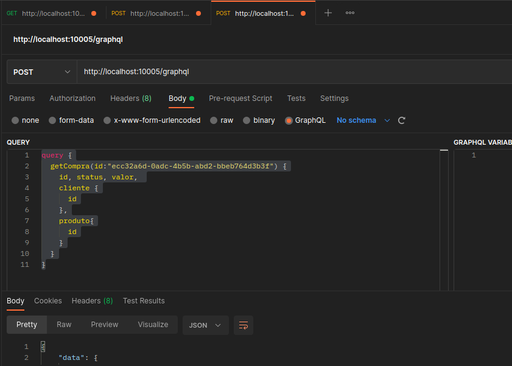

#POC - GraphQL - v1

###Console h2: http://localhost:10005/h2-console/

###Console Graphiql: http://localhost:10005/graphiql

* Exemplo de consulta
```javascript
  query {
      getCompra(id:"ecc32a6d-0adc-4b5b-abd2-bbeb764d3b3f") {
        id, status, valor,
        cliente {
          id
        },
        produto{
          id
        }
      }
  }
```


* Exemplo de cadastro:
```javascript
mutation {
    compra:saveCompra(compra:{
        valor:100,
        status:"OK",
        clienteId:"19997dfb-0c20-4689-9b85-1417611c6ffd",
        produtoId:"e29400d1-8081-4bed-9796-4f6c8b1401f7"
    }){
        id, status
    }
}
```

